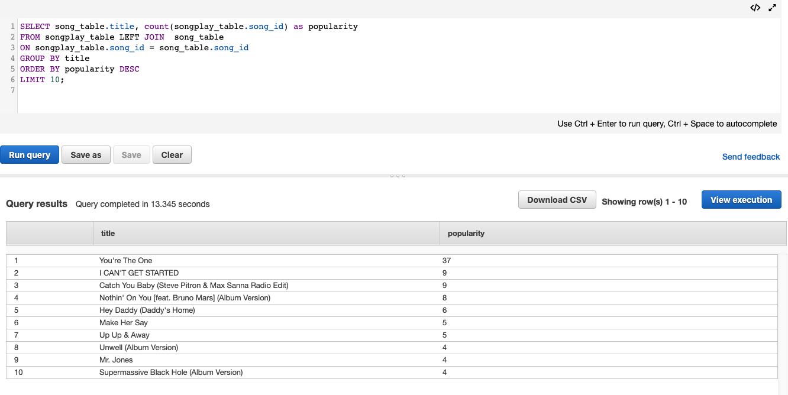

# Data-Warehouse-AWS
<h2>Introduction</h2>
The music streaming startup, Sparkify, has grown their user base and song database and want to move their processes and data onto the cloud. <strong>This project builds an ETL pipeline that extracts their data from S3, stages them in Redshift, and transforms data into a fact table and a set of dimensional tables for the use of the analytics team </strong>

-------------------------------------------------

<h2>Database Staging Tables and Star Schema Designed Tables(Fact and Dimension Tables)</h2>
<h4>Staging Tables:</h4>
<ol>
<li>staging_songs_table - metadata about a song and the artist of that song</li>
<ul>
<li>num_songs, artist_id, artist_latitude, artist_longitude,  artist_location, artist_name, song_id, title, duration, year</li>
</ul>
<li>staging_events_table - Simulated app activity logs from the music streaming app </li>
<ul>
<li>artist, auth, firstName, gender, itemInSession,lastName, length, level, location,
method, page, registration, sessionId, song, status, ts, userAgent, userId</li>
</ul>
</ol>

<h4>Fact Table:</h4>
<ol>
<li>songplay_table - records in event data associated with song plays i.e. records with page NextSong</li>
<ul>
<li>songplay_id (primarykey), start_time(sortkey, reference to time_table(start_time)), user_id(reference to user_table(user_id)), level, song_id(distkey, reference to song_table(song_id)), artist_id(reference to artist_table(artist_id)), session_id, location, user_agent</li>
</ul>
</ol>

<h4>Dimension Tables:</h4>
<ol>
<li>user_table - users in the app</li>
<ul>
<li>user_id(primarykey, sortkey), first_name, last_name, gender, level</li>
</ul>
<li>song_table - songs in music database</li>
<ul>
<li>song_id(primarykey,sortkey,distkey), title, artist_id, year, duration</li>
</ul>
<li>artist_table - artists in music database</li>
<ul>
<li>artist_id(primarykey,sortkey), name, location, latitude, longitude</li>
</ul>
<li>time_table - timestamps of records in songplays broken down into specific units</li>
<ul>
<li>start_time(primarykey,sortkey), hour, day, week, month, year, weekday</li>
</ul>
</ol>

---------------------------------

<h2>ETL Pipeline</h2>
sql_queries.py stores all the SQL queries that will be used by create_tables.py and etl.py 
The create_tables.py script will create staging tables and star schema tables on redshift clusters. 
The etl.py script will automate the ETL process by migrating songs and log-events data from S3 to staging tables on redshift and inserting data from staging tables into star schema designed tables.

---------------------------------

<h2>Running Instruction</h2>
<ol>
<li>Follow steps in IaC.ipynb to create the Redshift cluster </li>
<li>Run create_tables.py to drop tables(if existed) and create tables</li>
<li>Run etl.py to do the ETL process</li>
<li>Try some SQL queries on the redshift database (you can use Query Editor on redshift console) to do analytics</li>
</ol>
NOTE: Some confidential credentials about AWS have been removed from the configuration file,dwh.cfg. Remember to fill your own credentials in order to create the cluster and delete the cluster after finishing all the process)

---------------------------------

<h2>Queries and Results Examples</h2>

